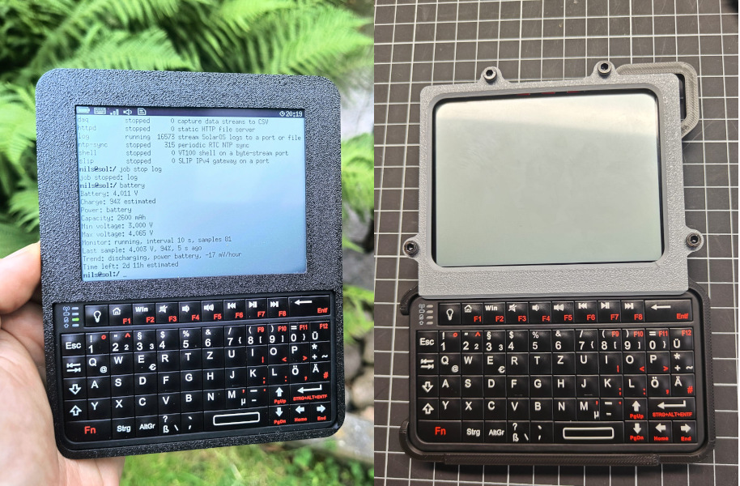

# SolarTerm



**[SolarOS](https://github.com/nilseuropa/solar_os) on the Waveshare ESP32-S3-RLCD-4.2**

## Build

* Build instructions for the [case designed by ATA F&E](doc/build_ata.md).
* Original build instructions are [here](doc/build_nils.md).

## Install SolarOS

You need Git, Python 3, [PlatformIO Core](https://docs.platformio.org/en/latest/core/installation/index.html),
and a data-capable USB-C cable. The commands below are for Linux and macOS;
Windows users can run the same `pio` commands in a PlatformIO IDE terminal.

Do not run PlatformIO with `sudo`. If `pio` is not on your `PATH` after
installation, run:

```sh
export PATH="$PATH:$HOME/.platformio/penv/bin"
```

### 1. Download and compile

```sh
git clone https://github.com/nilseuropa/solar_os.git
cd solar_os
pio run -e waveshare_esp32_s3_rlcd_4_2
```

The first build downloads the toolchain and dependencies. Continue after
PlatformIO reports `SUCCESS`.

### 2. Connect the board

Connect the board's Type-C port to the computer and press **PWR** once. Hold the
PCB rather than using the fragile display as leverage when connecting the
cable.

Find the serial port:

```sh
pio device list
```

Typical port names are `/dev/ttyACM0` on Linux, `/dev/cu.usbmodem...` on macOS,
and `COM...` on Windows. Replace `<PORT>` below with the complete name.

### 3. Flash

Long-press **PWR** to turn the board off. Hold **BOOT**, press **PWR** once, and
release **BOOT** when the USB port appears. Then flash SolarOS:

```sh
pio run -e waveshare_esp32_s3_rlcd_4_2 -t upload --upload-port <PORT>
```

Keep the cable connected until PlatformIO reports `SUCCESS`. The board should
restart automatically; press **PWR** if it remains in download mode.

### Troubleshooting

- **No serial port:** try another data cable or USB port, then repeat the
  **BOOT/PWR** sequence.
- **Permission denied on Linux:** install PlatformIO's
  [udev rules](https://docs.platformio.org/en/latest/core/installation/udev-rules.html),
  reconnect the board, and apply any requested group change.
- **Upload cannot connect:** close programs using the serial port, enter
  download mode again, and retry with the port currently shown by
  `pio device list`.
- **Stale build configuration:** run
  `pio run -e waveshare_esp32_s3_rlcd_4_2 -t clean`, then build again.

## First boot on the assembled device

1. Press **PWR** on SolarTerm and wait for the SolarOS shell to appear.
2. Turn on the Rii keyboard using the switch on its side.
3. Press the pairing button on the back of the keyboard to put it in pairing
   mode.
4. Press and hold SolarTerm's **KEY** button for about two seconds. _(Release it
   when SolarOS shows that BLE keyboard pairing has started.)_
5. Wait for the keyboard to connect, then type at the shell to test it.

SolarOS remembers the keyboard after the first connection and reconnects to it
automatically on later boots. A long press of **KEY** starts pairing again; a
second long press while pairing cancels it.

## Optional SD card preparation

SolarTerm works without an SD card. To use one, format it as FAT32 on a computer
and insert it while SolarTerm is powered off.

SolarOS mounts the card automatically at `/sdcard` during boot. Check it with:

```text
sd status
df
```

If the card is detected but not mounted, run `sd lsblk` and then `sd mount`.

## Update SolarOS over the air

Run `wifi` and connect SolarTerm to a wireless network. Then check for and
install the latest compatible SolarOS release:

```text
ota check
ota upgrade
```

SolarOS verifies the update, writes it to the inactive firmware slot, and
reboots into it. Keep the device powered on until the upgrade finishes.

## More information

Visit [solar-os.eu](https://solar-os.eu/) for more information, documentation,
tutorials, and project updates.
