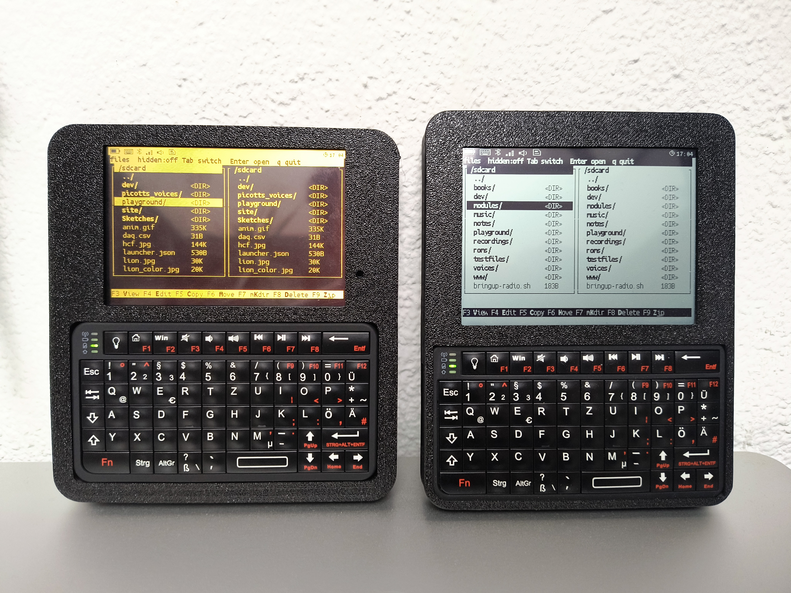

# SolarTerm



SolarTerm is a family of handheld enclosures for running
[SolarOS](https://github.com/nilseuropa/solar_os). Each design combines an
ESP32-S3 display board with a Rii 518BT Mini Bluetooth keyboard, battery power,
and optional microSD storage.

Two board families are supported:

- **SolarTerm RLCD** uses the reflective
  [Waveshare ESP32-S3-RLCD-4.2](https://docs.waveshare.com/ESP32-S3-RLCD-4.2).
- **SolarTerm IPS** uses the color, capacitive-touch Freenove ESP32-S3 Display
  4.0-inch (FNK0104S).

> [!IMPORTANT]
> The RLCD and IPS enclosures are board-specific. Their printed parts, battery
> arrangements, connectors, and pin assignments are not interchangeable.

SolarOS names the Waveshare configuration `solar_term` and the Freenove
configuration `freenove_esp32_s3_display_4_0`.

## Build the enclosure

Three enclosure designs are included:

- [IPS enclosure](doc/build_ips.md) — the enclosure for the Freenove 4.0-inch
  IPS board.
- [ATA F&E RLCD enclosure](doc/build_ata.md) — the multipart Waveshare design,
  with threaded inserts and an optional protective acrylic window.
- [Original RLCD enclosure](doc/build_nils.md) — the simpler Waveshare
  proof-of-concept print-and-screw design.

Read the selected build guide before ordering or printing parts. The display is
fragile and must not be used as leverage while inserting a cable, battery, or
enclosure part.

## Install SolarOS

For a first installation or recovery, use the
[SolarOS Web Flasher](https://solar-os.eu/flasher.html) in Chrome or Edge on a
desktop computer. Connect the board with a data-capable USB cable and select
the entry that matches the enclosure:

| Enclosure | Board in the Flasher |
| --- | --- |
| SolarTerm RLCD | SolarTerm (Waveshare ESP32-S3-RLCD-4.2) |
| SolarTerm IPS | Freenove ESP32-S3 Display 4.0-inch (FNK0104S) |

The Flasher downloads and verifies the selected official release before
installing it. Follow its board-specific download-mode instructions and keep
the USB cable connected until installation completes.

To build or flash SolarOS from source instead, follow the
[SolarOS quick start](https://solar-os.eu/quick-start.html#build-and-flash-from-source).
It lists the required tools, PlatformIO environments, upload commands, and
troubleshooting steps for supported boards.

## First boot

1. Power the board and wait for the SolarOS shell.
2. Turn on the Rii keyboard with its side switch.
3. Press the pairing button on the back of the keyboard.
4. Hold the board's SolarOS **KEY** button for about two seconds: **KEY** on the
   Waveshare board, or **BOOT** on the Freenove board after SolarOS has started.
   Release it when the keyboard icon changes to its pairing or scanning state.
   The display shell does not print a pairing message.
5. Wait for the keyboard to connect, then type at the shell.

SolarOS remembers the keyboard and reconnects on later boots. A long press of
**KEY** starts pairing again; a second long press while pairing cancels it.

## Optional microSD card

SolarTerm works without a card. To add storage, format a microSD card as FAT32
and insert it while SolarTerm is powered off. SolarOS mounts it at `/sdcard`
during boot.

```text
sd status
df
```

If the card is detected but not mounted, run `sd lsblk` and then `sd mount`.

## Update SolarOS over the air

Run `wifi` and connect to a network, then check for and install the latest
compatible SolarOS release:

```text
ota check
ota upgrade
```

SolarOS verifies the image, writes it to the inactive firmware slot, and
reboots into it. Keep the device powered until the upgrade finishes.

## Expansion cards

The Waveshare RLCD board has a 2 × 8 expansion header with 2.54 mm pitch.
SolarTerm cards use 3.3 V logic and follow the SolarOS pin assignments. They do
not fit the Freenove IPS board. See the
[SolarTerm expansion-card guide](expansions/README.md) before designing or
connecting a card.

The repository currently includes the [SolarLink radio expansion](expansions/solarlink/README.md),
with Autodesk EAGLE source, Gerber files, build information, and a photograph
of the functional prototype.

## More information

Visit [solar-os.eu](https://solar-os.eu/) for SolarOS documentation, tutorials,
and project updates.
