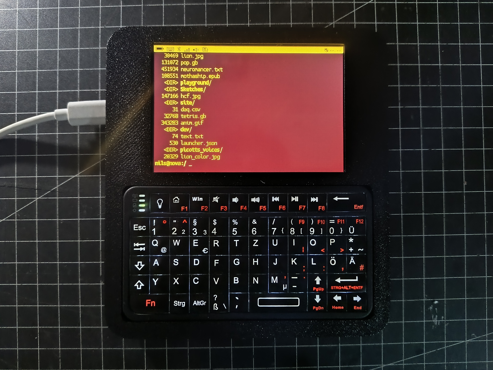
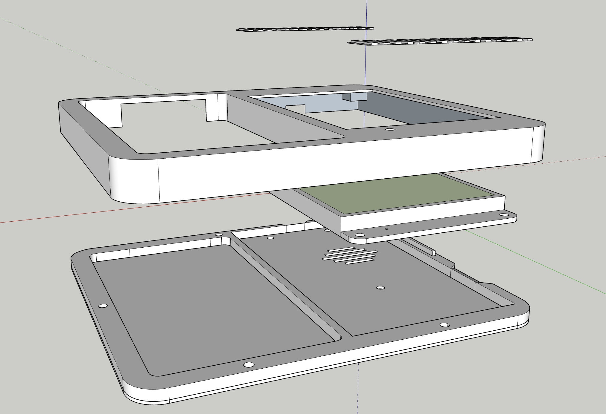
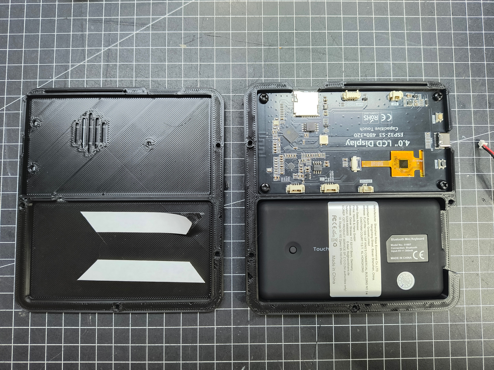
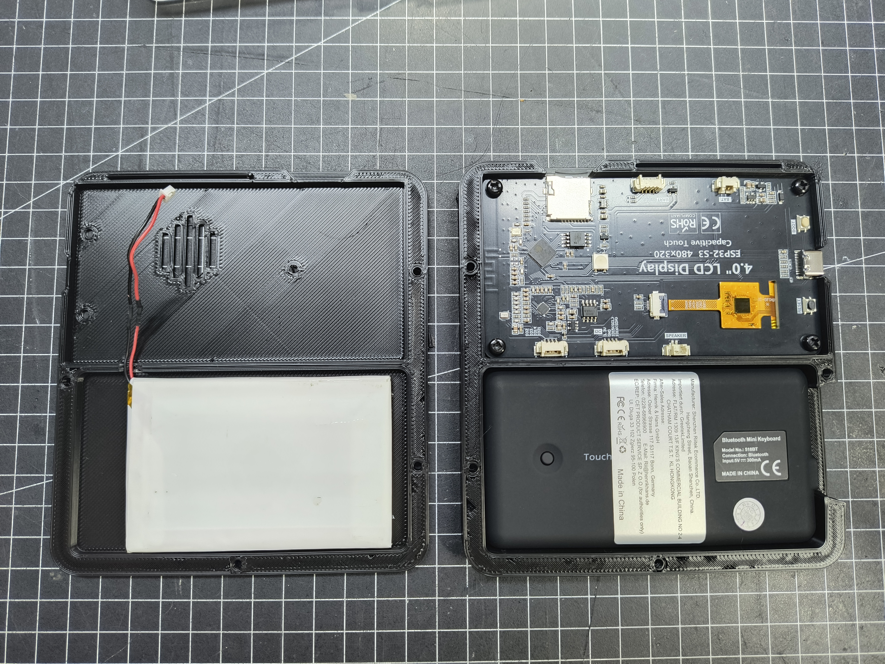
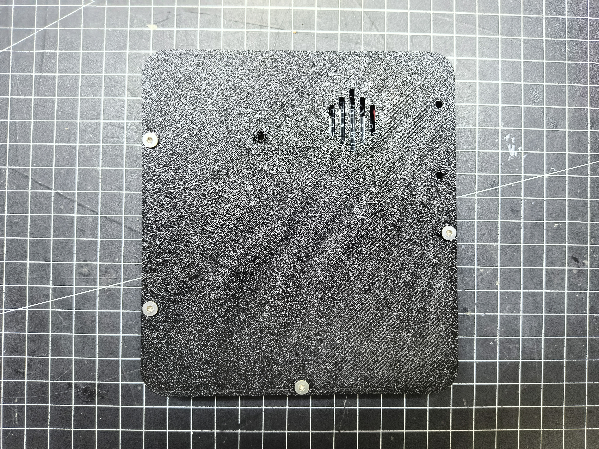
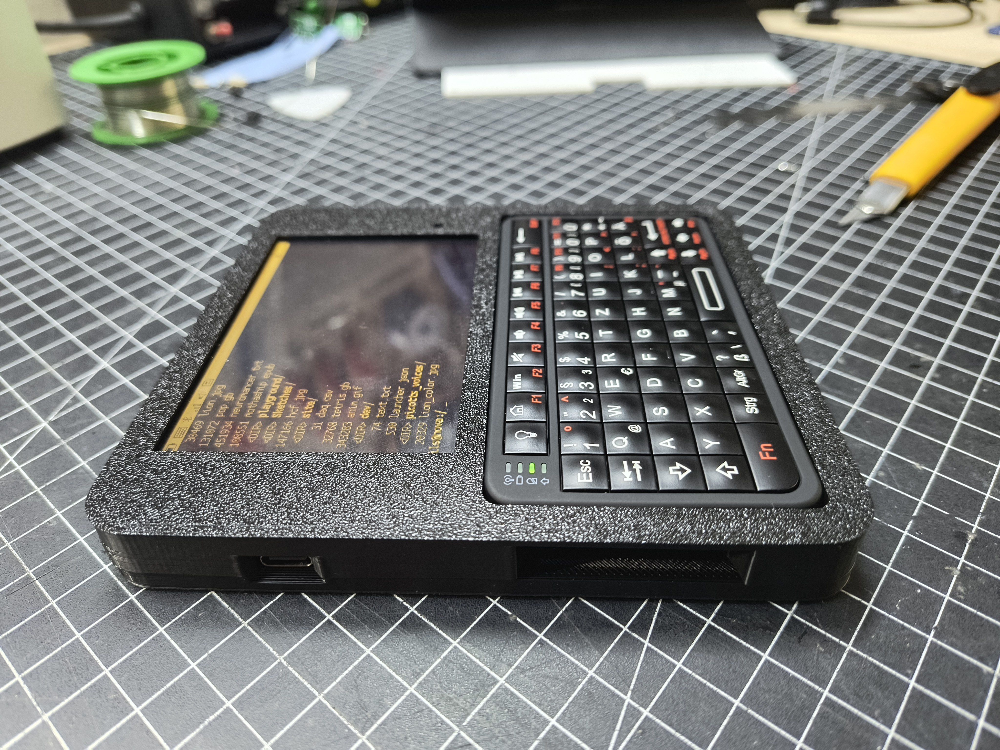

# SolarTerm IPS enclosure

This enclosure fits the **Freenove ESP32-S3 Display 4.0-inch (FNK0104S)**. It
combines the board's 480 × 320 color capacitive-touch display with a Rii 518BT
Mini Bluetooth keyboard.

> [!IMPORTANT]
> This enclosure does not fit the Waveshare ESP32-S3-RLCD-4.2. Use one of the
> RLCD enclosure guides for that board.

## Parts

- 1 × **Freenove ESP32-S3 Display 4.0-inch (FNK0104S)** board
- 1 × Rii 518BT Mini Bluetooth keyboard
- 1 × protected 3.7 V single-cell LiPo battery that fits the enclosure
- 1 × microSD card, optional but recommended
- 1 × board-compatible speaker, optional
- the board-mounting screws supplied with the Freenove board
- case screws suitable for the printed holes
- thin double-sided mounting tape for the battery and, if needed, the keyboard
- [Top enclosure](../stl/ips/ips_top.stl)
- [Bottom enclosure](../stl/ips/ips_bottom.stl)
- [Decorative grille pieces](../stl/ips/ips_gribly.stl)

The editable [SketchUp model](../sketchup/solartem_ips.skp) is included for
enclosure changes.

Use only a battery intended for the board's battery input. Check connector
polarity against the board markings before connection; matching connector
shells do not guarantee matching polarity.

## Assembly

Work on a clean, soft surface. Do not press on the display or touchscreen, and
keep tools and screw tips away from the LiPo cell.

### 1. Print and inspect the enclosure

Print the top, bottom, and decorative grille pieces. Remove supports and test
the board, keyboard, USB-C opening, buttons, screw holes, and grille pieces
before installing the electronics.

### 2. Install the display board and keyboard

Place the display board into the top enclosure without using the display as a
handhold. Secure it with its original mounting screws, tightening only until
the board is held evenly. Seat the keyboard in its opening with its charging,
power, and pairing controls accessible. Use thin double-sided tape only if the
keyboard can move in the print.

### 3. Install the battery and optional speaker

With the battery disconnected, secure it flat in the bottom enclosure using
thin double-sided tape. Keep the cell clear of screw bosses, sharp print edges,
and the speaker vent. Fit the optional speaker in the vented recess and route
its cable without crossing a screw hole.

### 4. Install and test SolarOS

Insert the optional microSD card, connect the board through USB-C, and follow
the [SolarOS installation instructions](../README.md#install-solaros). Select
**Freenove ESP32-S3 Display 4.0-inch (FNK0104S)** in the Web Flasher.

Confirm that the display, touch input, keyboard, microSD card, and optional
speaker work before closing the enclosure.

### 5. Connect the battery and close the enclosure

Disconnect USB power. Recheck battery polarity, then connect the battery and
place the two enclosure halves together without trapping a wire. Install the
case screws gradually and evenly. Stop when the halves meet; overtightening can
damage the print or load the display board.

### 6. Final check

Check that USB-C, **BOOT**, **RESET**, keyboard controls, and ventilation remain
clear. Power the board, wait for the SolarOS shell, and pair the keyboard as
described in the [first-boot instructions](../README.md#first-boot).

The assembled CAD view is also available as a
[placement reference](ips/ips_assembled.png).
