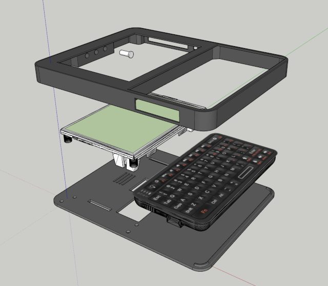
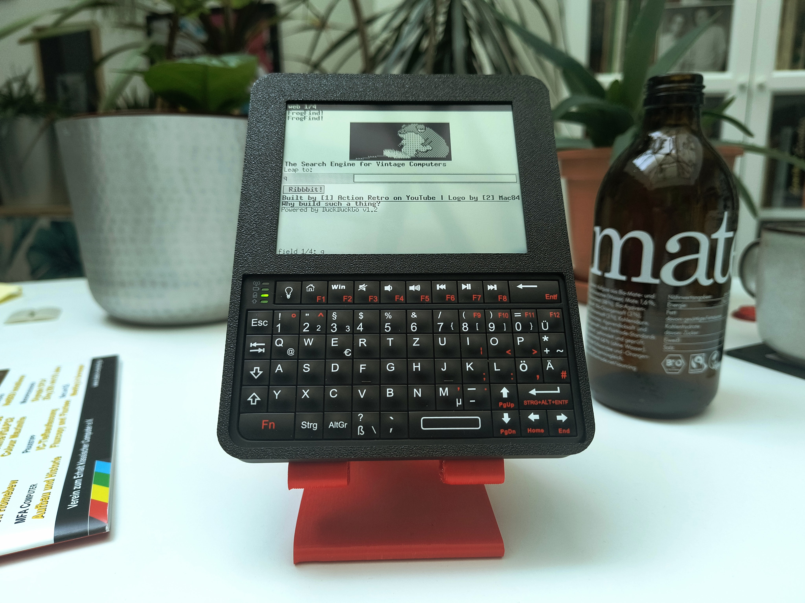

# Original SolarTerm RLCD enclosure

This is the original proof-of-concept enclosure. It is a print-and-screw build
and does not require soldering.

## Parts

- 1 × **Waveshare ESP32-S3-RLCD-4.2** board
- 1 × Rii 518BT Mini Bluetooth keyboard
- 1 × 18650 lithium-ion battery suitable for the Waveshare holder
- 1 × microSD card, optional but recommended
- 4 × original screws supplied with the Waveshare kit
- 4 × M3 × 10 mm screws
- [Bottom enclosure](../stl/rlcd/rlcd_bottom.stl)
- [Top enclosure](../stl/rlcd/rlcd_top.stl)
- [Three buttons](../stl/rlcd/rlcd_button.stl)

The editable [SketchUp model](../sketchup/solarterm_rlcd.skp) is included for
enclosure changes.

Use only the Waveshare ESP32-S3-RLCD-4.2. Other Waveshare ESP32-S3 and e-paper
boards do not fit this enclosure.

## Assembly

The RLCD panel is sensitive to impact, bending, and point loads. Check the
printed-part fit before assembly and work on a clean, soft surface.

1. Print the top, bottom, and three button parts.
2. Attach the Waveshare board to the bottom enclosure with the four screws
   supplied with the board. Tighten only until secure.
3. Put the top enclosure face-down, insert the buttons, and fit the keyboard.
4. If the keyboard moves, secure it with double-sided tape no more than 1 mm
   thick.
5. Align the enclosure halves without trapping the keyboard or speaker wiring.
6. Fasten the halves with the four M3 × 10 mm screws.
7. Insert the battery with the polarity shown on the Waveshare holder.
8. Follow the [SolarOS installation instructions](../README.md#install-solaros)
   and select **SolarTerm (Waveshare ESP32-S3-RLCD-4.2)** in the Web Flasher.

