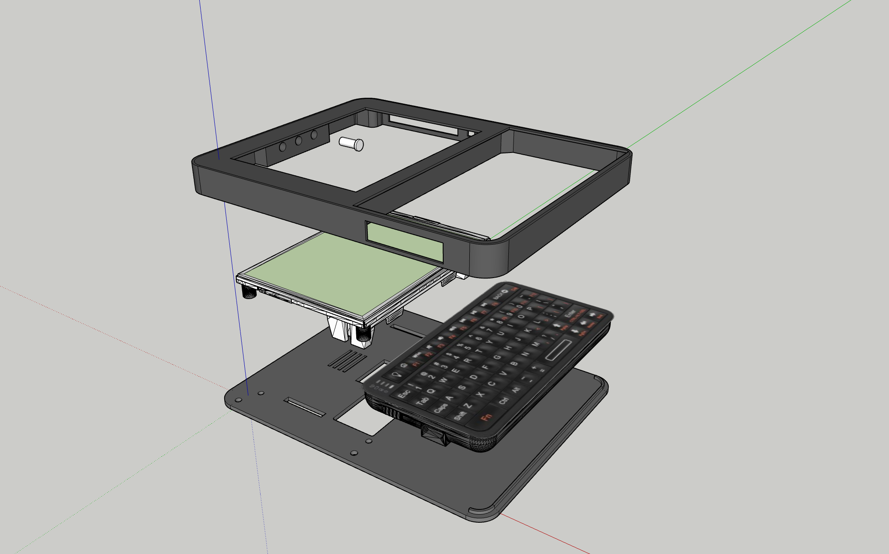

### Parts

- 1x **Waveshare ESP32-S3-RLCD-4.2** board _(not a similarly named ESP32-S3 or e-paper board)_
- 1x SD Card _(optional, but recommended)_
- 1x Rii 518BT Mini BLE keyboard
- 1x 18650 lithium battery
- 4x original screws from the Waveshare KIT
- 4x M3 x 10 mm screws
- [Bottom enclosure](../stl/poc_bottom.stl)
- [Top enclosure](../stl/poc_top.stl)
- [Buttons](../stl/poc_button.stl)

### Assembly

This is a print-and-screw build; no soldering is required. The RLCD panel is
sensitive to stress, so check the fit of the printed parts and work on a smooth,
soft surface.

1. Print the enclosure parts and three buttons.
2. Attach the RLCD board to the bottom enclosure with the screws supplied with
   the board.
3. Place the top enclosure face-down, insert the buttons, and fit the keyboard.
4. If needed, secure the keyboard with double-sided tape no more than 1 mm
   thick.
5. Align both enclosure halves and fasten them with the four M3 screws.
6. Insert the battery and install SolarOS.

