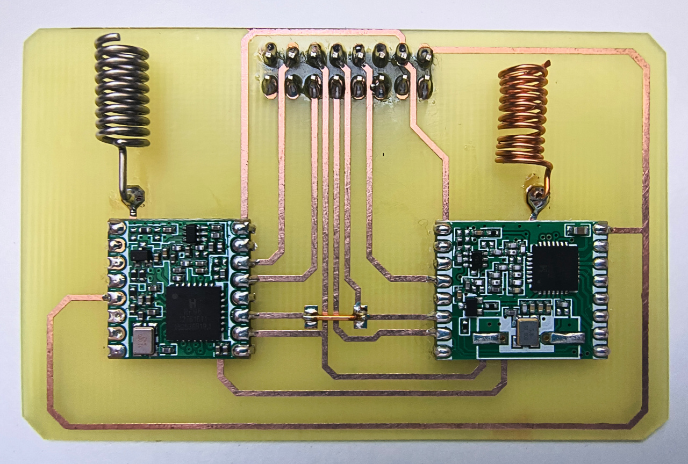

# SolarLink radio expansion

SolarLink adds two sub-GHz radios to SolarTerm:

- one `RFM69HW-868S2`;
- one `RFM95W-915S2`.

Both radios share one SPI bus. Each radio has its own chip-select signal and
antenna. The pictured prototype has been built and validated as functional with
the Waveshare ESP32-S3-RLCD-4.2 and SolarOS.



## Single-layer construction

SolarLink routes all tracks on one copper layer. This makes the PCB easy to
produce at home.

`R1` is a 0 Ω wire bridge, not a resistor. It carries MOSI across another track
without adding a second copper layer. Fit `R1` with a short insulated wire, as
shown in the photograph.

The PCB is 76.2 × 48.26 mm. It connects to the Waveshare board with a 2 × 8 male
header on a 2.54 mm pitch.

## Parts

- 1 × single-layer SolarLink PCB
- 1 × `RFM69HW-868S2` module
- 1 × `RFM95W-915S2` module
- 1 × 2 × 8 male header, 2.54 mm pitch
- 1 × short insulated wire for the `R1` bridge
- 1 × antenna for each fitted radio module

Use antennas for the frequency bands of the fitted modules.

## Electrical connections

| SolarTerm signal | SolarLink function |
| --- | --- |
| 3V3 | RFM69HW and RFM95W supply |
| GND | Radio ground |
| GPIO1 | Shared SPI SCK |
| GPIO2 | Shared SPI MOSI |
| GPIO3 | Shared SPI MISO |
| GPIO43 / TXD | RFM69HW NSS/chip select |
| GPIO44 / RXD | RFM95W NSS/chip select |
| GPIO17 | RFM95W reset |

The RFM69 reset signal and all DIO/IRQ signals are unconnected. SolarOS polls
the radio modules, so no IRQ connection is required.

GPIO43 and GPIO44 belong to `uart0` at boot. Use the display shell and detach
`uart0` before attaching either radio.

## Design and fabrication files

| Path | Contents |
| --- | --- |
| [`radio_expansion.sch`](radio_expansion.sch) | Autodesk EAGLE 7.7 schematic |
| [`radio_expansion.brd`](radio_expansion.brd) | Autodesk EAGLE 7.7 PCB layout |
| [`eagle.epf`](eagle.epf) | EAGLE project settings |
| [`gerber/`](gerber/) | Gerber and Excellon fabrication files |

## SolarOS setup

Start from the display shell and inspect the available resources:

```text
expansion layout
expansion status
expansion drivers
```

Detach `uart0`, create the shared SPI bus, and attach both radios:

```text
expansion bus detach uart0
expansion bus create spi solarlink host=spi3 sclk=gpio1 mosi=gpio2 miso=gpio3 cs=gpio43 cs=gpio44
expansion attach rfm69h radio69 spi=solarlink cs=gpio43
expansion attach rfm95 radio95 spi=solarlink cs=gpio44 reset=gpio17
radio status radio69
radio status radio95
```

Attach only the radio modules fitted to the card. Connect the antennas before
transmitting. Use frequencies and power levels allowed in your region.

To detach the radios and restore `uart0`:

```text
expansion detach radio95
expansion detach radio69
expansion bus remove solarlink
expansion bus attach uart0
```
